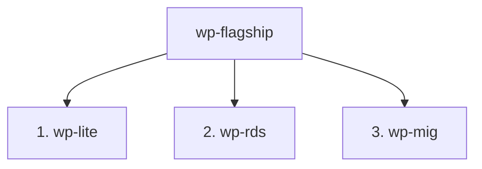
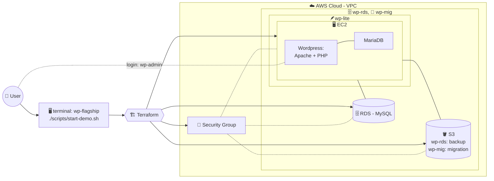
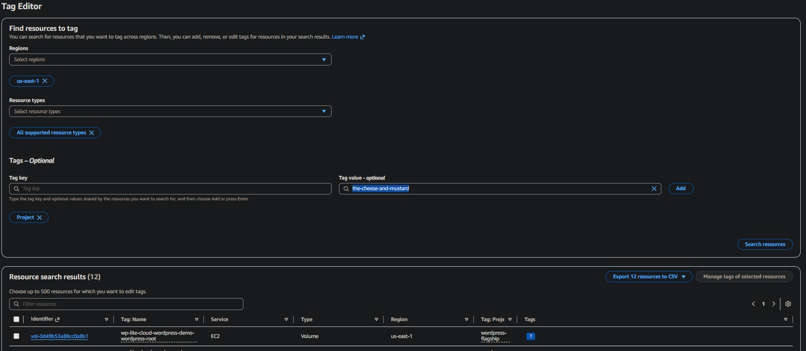

# wordpress-flagship
[](https://github.com/bebopinbebop/wordpress-flagship/actions/workflows/terraform-checks.yml)


## ☁️ Overview


### Hosting WordPress on AWS Resources automatically with Terraform as IaC.
 This project aims to build a WordPress (WP) project from your terminal onto your AWS account using Terraform-defined resources that coalesce into a functional website.


Below is a detailed breakdown of the project with supporting documents linked throughout to other sources within this project:

-  [QuickStart](#-quickstart)
-  [Features](#-features)
-  [Architecture](#-architecture-at-a-glance)
-  [Tech Stack & Notes](#️-tech-stack--notes)
-  [Continuous Integration](#-continuous-integration)
-  [Project Structure](#️-project-structure)
-  [Tagging Architecture](#️-tagging)
-  [TODO](#-todo)

## 🚀 QuickStart
First, clone the repo into your desired path using:
```bash
git clone https://github.com/bebopinbebop/wordpress-flagship.git
```

Then you must install any prerequisites that may be missing by running this in the project root:
```bash
chmod 700 scripts/install-prereqs.sh
./scripts/install-prereqs.sh
```
This will install some fundemental packages like `aws`, `terraform`, and `openssl`.

⚠️ You must have an `aws` account locally configured into your terminal via SSO or CLI login (old school) so the script can create resources on your behalf. More information found [here](https://docs.aws.amazon.com/signin/latest/userguide/command-line-sign-in.html).

⚠️ You must have an existing EC2 key-pair in your account that can be used by the script to help encrypt the box and facilitate `ssh` if needed.

Once all is cleared and good to go, from the project root, you can run:
```bash
./scripts/start-demo.sh
```

📌the project is going to perform another systems check to see if all needed packages are installed.

✅ From there, you may choose how you want to deploy WordPress for your intended purposes.

## ✨ Features

The project pushes WordPress on AWS resources by one of three ways, described below:

<!--  -->

1. [wp-lite](#wp-lite-light-version)
2. [wp-rds](#wp-rds-relational-database-services)
3. [wp-mig](#wp-mig-migration)

Each of the aforementioned sections in this project have their own dedicated documentation to act as a guide in how to operate them, with troubleshooting tips and explanations detailing the demo.

In the `Terraform` folder, there are three environments (`wp-lite`, `wp-rds`, `wp-mig`) that each contain their own resource definitions that will be built by `aws`. Some definitions are built off from previous ones, such as `wp-rds` being an extended version of `wp-lite`.

In essence, each project section creates an `ec2` instance that is then preloaded with `wordpress`, and then custom Security Groups, IAM permissions and attached resources build the necessary backend to support a fully functional webpage.

Each section varies in how much resources are attached to it for a diverse capability set, making each deployment uniquely equipped for a specific mission.

The end goal would be that for an individual to then login to the `\wp-admin` page and edit their WordPress webpage as they prefer.


## 🪶 wp-lite (Light Version)
**`wp-lite`** is a cost-effective environment that uses Terraform to deploy a complete WordPress stack (Apache, PHP, MariaDB, and WordPress) on a single EC2 instance within a custom AWS VPC. It's intended for portfolio demonstrations, testing, and rapid deployment while keeping AWS costs to a minimum. See further detail [here](docs/wp-lite-guide.md).

- Custom VPC with public and private subnets.
- One EC2 instance in a public subnet that installs WP via its **User Data** that's been altered.
- MariaDB installed on the same instance to support WP functionality like blog postings, plugins, and config files.
- No RDS, NAT Gateway, Load Balancer, or CloudFront.

Technical focus:

- Uses `terraform/environments/wp-lite` as a Terraform root module.
- Reuses the shared `vpc`, `security`, and `ec2` modules.
- Boots WordPress through EC2 User Data instead of manual server configuration.
- Keeps database traffic local to the instance by using `localhost` MariaDB.
- Tags resources with the standard `Project`, `Architecture`, `Deployment`, `ManagedBy`, and `Purpose` model for discovery and cleanup.
- Provides a low-cost baseline before moving into the more production-shaped `wp-rds` architecture.

## 🗄️ wp-rds (Relational Database Services)

**`wp-rds`** is a production-shaped development environment that uses Terraform to deploy a custom AWS VPC, a WordPress EC2 instance, a private Amazon RDS MySQL database, and an S3 bucket for future backup workflows. It costs more than `wp-lite` because RDS runs as a separate managed database.

It separates the web and database tiers while securing the internal networking, managed database provisioning, and infrastructure automation. The environment provides a live WordPress site with data stored in RDS, making it ideal for migration testing, client hosting demonstrations, and preparing for future production enhancements. See further detail [here](docs/wp-rds-guide.md).

- Custom VPC with public and private subnets.
- One EC2 instance in a public subnet.
- RDS MySQL database in private subnets.
- S3 bucket for future backups.
- Admin-only `/demo/rds-lab.php` page that writes demo rows to RDS and uploads files to S3.
- No NAT Gateway, Load Balancer, CloudFront, or HTTPS automation yet.

## 🚚 wp-mig (Migration)

**`wp-mig`** is a migration-focused environment designed to demonstrate the process of rehosting existing WordPress websites on AWS using Terraform. It provisions a clean AWS migration target based on the `wp-rds` architecture, then uses migration scripts and documentation to guide export, transfer, restore, reconfiguration, validation, rollback, and cleanup. Intended for client migrations, `wp-mig` showcases Infrastructure as Code (IaC), migration automation, and best practices for moving WordPress sites with minimal downtime. See further detail [here](docs/wp-mig-guide.md).

- EC2 web server for the migrated WordPress site
- Amazon RDS MySQL database
- Amazon S3 for backups and migration files
- Custom AWS VPC with public and private subnets
- Secure Security Group configuration
- WP-CLI source preflight
- Initial database export workflow
- Temporary staging/testing URL
- Planned `wp-content` export, S3 transfer, restore, URL replacement, validation, and rollback
- Future DNS cutover planning
- Future HTTPS support (ACM + Load Balancer)
- Future backup, monitoring, and production-readiness validation

## 🧭 Architecture at a Glance

The repository is organized around reusable Terraform modules and separate environment roots. Each environment calls the same module patterns where possible, then changes the database, storage, and migration behavior based on the target demo path.

The essential flow is:


From an Infrastructure as Code perspective, the project demonstrates environment separation, reusable modules, repeatable EC2 bootstrap automation, security group scoping, database tier choices, S3-backed demo storage, AWS resource tagging, and safe destroy workflows for short-lived portfolio deployments.

## 🛠️ Tech Stack & Notes
Below is a breakdown of what the project builds/uses, and also the reasoning for certain decisions for the project.

- Terraform
- AWS VPC
- AWS EC2
- AWS RDS MySQL
- AWS S3
- Bash
- WordPress
- Apache
- PHP (from WordPress)
- MariaDB

Notes as to why certain constraints where chosen:

 - `Terraform` was chosen over AWS CloudFormation because Terraform is popular, vendor-neutral, and adaptable to other Cloud Service Providers (CSPs), meaning other companies feel safer having the option to spin up their infrastructure on another platform if their current CSP is lacking.

 - `aws` was chosen due to the huge market share that affords dependability and reliability for projects built on it. The economy-of-scale that AWS provides also functions as a good support network for when things go wrong.

 - `WordPress` was chosen due to how it affords companies that may not have a technical background to get a professional image out to their clients, and the huge market share that WordPress has as a Content Management System (CMS).

## 🔄 Continuous Integration

This repository uses GitHub Actions to validate Terraform code on pushes to `main` and on pull requests, as seen below:

[](https://github.com/bebopinbebop/wordpress-flagship/actions/workflows/terraform-checks.yml)

The Terraform Checks workflow does the following:
- runs `terraform fmt -check -recursive`
- verifies Bash script syntax recursively under `scripts/`
- runs ShellCheck
- checks that local Terraform state and `.tfvars` files are not committed
- runs `terraform init -backend=false` plus `terraform validate` for the implemented Terraform environments.

The workflow validates the implemented Terraform environments: `wp-lite`, `wp-rds`, and `wp-mig`.

CI validates infrastructure code only. It does not run `terraform apply` and does not deploy AWS resources.

## 🏗️ Project Structure
Below is the expected layout from the project root. Some things are ignored to simplify the layout so that it makes sense:
```text
.
├── docs/
│   ├── cost-control.md
│   ├── cost-estimate.md
│   ├── wp-mig-guide.md
│   ├── wp-lite-guide.md
│   ├── wp-rds-guide.md
│   ├── deployment-guide.md
│   ├── migration-guide.md
│   ├── portfolio-case-study.md
│   └── security.md
├── scripts/
│   ├── check-migration-readiness.sh
│   ├── destroy-stack.sh
│   ├── diagnose-wp-lite.sh
│   ├── install-terraform.sh
│   ├── install-wordpress-local-db.sh
│   ├── install-wordpress-rds.sh
│   ├── install-wordpress.sh
│   ├── prepare-migration.sh
│   ├── start-demo.sh
│   ├── wait-for-site.sh
│   └── seed-wordpress.sh
├── website/
│   └── default-site/
└── terraform/
    ├── environments/
    │   ├── wp-lite/
    │   ├── wp-mig/
    │   └── wp-rds/
    └── modules/
        ├── ec2/
        ├── rds/
        ├── s3/
        ├── security/
        └── vpc/
```


## 🔑 Secret Handling

🚫 Do not commit real secrets 🚫

 The guided launcher writes deployment values to an ignored local `terraform.tfvars` file so Terraform can bootstrap the deployment without storing credentials in Git.

For the current MVP, keep these values local:

- Database username and password.
- WordPress admin username, email, and password.
- EC2 SSH key material.
- AWS CLI profile configuration.

📋 Future production work should move secrets into AWS Secrets Manager or AWS Systems Manager Parameter Store.

## 🏷️ Tagging

Since AWS supports key-pair tags, this project identifies artifacts made with ease. This is done so that anyone can find anything built within their AWS account by looking up tags.

AWS resources are being organized around a standard tag identity model:

```text
Project -> Architecture -> Deployment -> Resource
```

Example tags:

```text
Project      = wordpress-flagship
Architecture = wp-rds
Deployment   = demo-001
ManagedBy    = terraform
```

This model is intended to improve resource discovery, cleanup verification, troubleshooting, and future cost reporting. A good example would be that the `scripts/destroy-stack.sh` uses these `tags` to help discover what needs to be destroyed.

You can see all of the resources that the project makes by using `Tag Editor`:


Read-only resource discovery is available with:

```bash
./scripts/resources.sh list --architecture wp-lite --deployment wp-lite-test
```

More detail about this tagging mechanism can be found [here](docs/tagging-architecture.md)


## 📋 TODO:

- README polish
- All three guides are consistent.
- GIF/screenshots
- wp-lite, wp-rds, and wp-mig deploy successfully.
- Destroy script reliably cleans up resources.
- GitHub Actions pass.
- No secrets/state files are tracked.
- one clean “case study” section explaining the business value.
