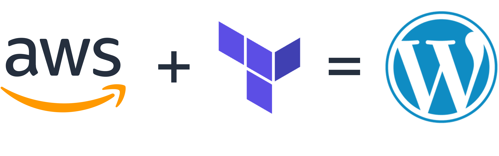

# WordPress Flagship



## Intro - Hosting WordPress on AWS resources automatically with Terraform as the IaC.

This project aims to build a WordPress (WP) project from your terminal onto your AWS account using Terraform-defined resource definitions that coalesce into a logical website.

Terraform was chosen over AWS CloudFormation because Terraform is popular, vendor-neutral, and adaptable to other Cloud Service Providers (CSPs).

There are three sections to this project that each try and solve a unique problem as described below:


## wp-lite

**`dev-lite`** is a cost-effective demonstration environment that uses Terraform to deploy a complete WordPress stack (Apache, PHP, MariaDB, and WordPress) on a single EC2 instance within a custom AWS VPC. It's intended for portfolio demonstrations, testing, and rapid deployment while keeping AWS costs to a minimum. See further detail [here](docs/dev-lite-guide.md).

- Custom VPC with public and private subnets.
- One EC2 instance in a public subnet that installs WP via its **User Data** that's been altered.
- MariaDB installed on the same instance to support WP functionality like blog postings, plugins, and config files.
- No RDS, NAT Gateway, Load Balancer, or CloudFront.

## wp-rds (Relational Database Services)

**`dev-rds`** is a production-oriented development environment that uses Terraform to deploy a custom AWS VPC, a WordPress EC2 instance, a private Amazon RDS MySQL database, and an S3 bucket for future backup workflows. This is meant for **Production Level Deployment**, so major costs are rendered on an AWS account. Designed for real-world AWS architecture, it separates the web and database tiers while securing the internal networking, managed database provisioning, and infrastructure automation. The environment provides a live WordPress site with data stored in RDS, making it ideal for migration testing, client hosting demonstrations, and preparing for future production enhancements. See further detail [here](docs/dev-rds-guide.md).

- Custom VPC with public and private subnets.
- One EC2 instance in a public subnet.
- RDS MySQL database in private subnets.
- S3 bucket for future backups.
- [ ] TODO: No NAT Gateway, Load Balancer, or CloudFront yet.

## wp-mig (Migration)

**`dev-mig`** is a migration-focused environment designed to demonstrate the process of rehosting existing WordPress websites on AWS using Terraform. It provisions a production-style AWS environment and provides a repeatable workflow for importing WordPress content, databases, and media into a secure AWS infrastructure. Intended for client migrations, portfolio demonstrations, and freelance engagements, `dev-mig` showcases Infrastructure as Code (IaC), migration automation, and best practices for transitioning WordPress sites with minimal downtime.

- EC2 web server for the migrated WordPress site
- Amazon RDS MySQL database
- Amazon S3 for backups and migration files
- Custom AWS VPC with public and private subnets
- Secure Security Group configuration
- WP-CLI migration automation
- Database import workflow
- `wp-content` import (themes, plugins, uploads)
- Domain search-and-replace automation
- Temporary staging/testing URL
- DNS cutover planning
- Rollback procedures
- Future HTTPS support (ACM + Load Balancer)
- Backup, monitoring, and production-readiness validation

### Requirements and Tips

There are requirements to make this project work, as described below:

 - Shell terminal - this project was built using WSL on Windows 11. This means the project is intended for Debian Linux environments or Zsh. PowerShell is theoretically possible but was not pursued due to the ubiquity of Linux terminals.
 - AWS CLI - you need to install the AWS CLI locally on the machine you wish to push this from. Here is a [link](https://docs.aws.amazon.com/cli/latest/userguide/getting-started-install.html#:~:text=The%20install%20script%20downloads%2C%20verifies%2C%20and%20installs%20the%20AWS%20CLI%20for%20Linux%20in%20one%20step.%20It%20works%20for%20both%20Linux%20x86%20(64%2Dbit)%20and%20Linux%20ARM%2C%20and%20installs%20for%20the%20current%20user%20by%20default.) to do so.
 - AWS SSO logged in - this project assumes you have an AWS IAM identity logged in as your default account in the AWS CLI. This requires you to have a profile set up in your AWS account's IAM Identity Center that **has the right permissions** to create and destroy resources. Here is a [link](https://docs.aws.amazon.com/cli/latest/userguide/cli-configure-sso.html#cli-configure-sso-configure) to do so.


The project supports two beginner-friendly development environments:

- `dev-lite`: one EC2 instance with WordPress and MariaDB installed locally. This is the cheapest demo path and is intended to be destroyed after use.
- `dev-rds`: one EC2 instance running WordPress, with RDS MySQL in private subnets and an S3 bucket reserved for backups.

Both development environments intentionally avoid NAT Gateway, Load Balancer, and CloudFront in the first MVP to keep costs and complexity low.

The deployed site uses WordPress as the main editable website:

```text
/          WordPress site
/wp-admin/ WordPress admin dashboard
/demo/     Static Terraform/AWS infrastructure demo
```

## Architecture Goals

- Build a repeatable WordPress infrastructure using Terraform.
- Keep networking, security, compute, database, and storage concerns separated into modules.
- Support separate `dev-lite`, `dev-rds`, and `prod` environments.
- Use placeholder variables for sensitive values and never commit real secrets.
- Start with simple EC2-based MVPs, then evolve toward HTTPS, domains, backups, monitoring, and production automation.


## Tech Stack

- Terraform
- AWS VPC
- AWS EC2
- AWS RDS MySQL
- AWS S3
- Bash
- WordPress
- Apache
- PHP
- MariaDB

## Project Structure

```text
.
├── docs/
│   ├── cost-control.md
│   ├── cost-estimate.md
│   ├── dev-lite-guide.md
│   ├── dev-rds-guide.md
│   ├── deployment-guide.md
│   ├── migration-guide.md
│   ├── portfolio-case-study.md
│   └── security.md
├── scripts/
│   ├── destroy-stack.sh
│   ├── diagnose-dev-lite.sh
│   ├── install-terraform.sh
│   ├── install-wordpress-local-db.sh
│   ├── install-wordpress-rds.sh
│   ├── install-wordpress.sh
│   ├── prepare-migration.sh
│   ├── start-demo.sh
│   ├── wait-for-site.sh
│   └── seed-wordpress.sh
├── website/
│   └── default-site/
└── terraform/
    ├── environments/
    │   ├── dev-lite/
    │   ├── dev-rds/
    │   └── prod/
    └── modules/
        ├── ec2/
        ├── rds/
        ├── s3/
        ├── security/
        └── vpc/
```

## Phases

### Phase 1: Development MVPs

- Deploy `dev-lite` for low-cost single-instance demos.
- Deploy `dev-rds` for a more realistic EC2 + RDS architecture.
- Seed demo WordPress content with WP-CLI.
- Document deployment, security, and cost controls.

### Phase 2: Production Hardening

- Add HTTPS with an Application Load Balancer and ACM certificate.
- Move EC2 instances into private subnets.
- Add NAT gateway or private package installation strategy.
- Add automated RDS backups and snapshot policies.
- Add CloudWatch logs, alarms, and dashboards.

### Phase 3: Scalability

- Add Auto Scaling Group support.
- Store WordPress uploads in S3.
- Add CloudFront CDN.
- Add ElastiCache for object/page caching.
- Split reusable modules into versioned releases.

## Deliverables

- Beginner-friendly Terraform module structure.
- Separate development and production environment folders.
- Guided startup and cleanup scripts.
- WordPress installation and seed scripts.
- Deployment guide.
- Security notes.
- Cost estimate notes.
- Static demo website files under `website/default-site`.
- A clean GitHub-ready project layout.

## Secret Handling

Do not commit real secrets. The guided launcher writes deployment values to an ignored local `terraform.tfvars` file so Terraform can bootstrap the demo without storing credentials in Git.

For the current MVP, keep these values local:

- Database username and password.
- WordPress admin username, email, and password.
- EC2 SSH key material.
- AWS CLI profile configuration.

Future production work should move secrets into AWS Secrets Manager or AWS Systems Manager Parameter Store.
