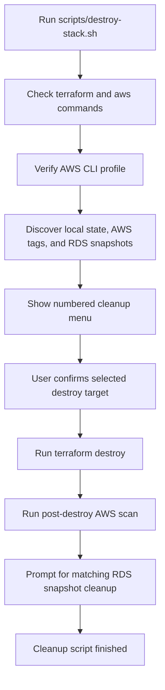

# 🧹 Destroy Guide

This guide explains how the WordPress Flagship cleanup script works, what it destroys, and what you should type when you want to remove AWS resources created by this project.

## 🎯 Purpose

AWS resources can keep billing after a demo is finished. The destroy workflow exists to help you safely clean up `wp-lite`, `wp-rds`, and `wp-mig` deployments so you do not leave EC2 instances, RDS databases, S3 buckets, EBS volumes, snapshots, or networking resources running by accident.

The cleanup script is:

```bash
./scripts/destroy-stack.sh
```

The script prefers `terraform destroy` because Terraform understands how the resources depend on each other. For example, Terraform knows that an EC2 instance should be destroyed before its security group and that a subnet should be removed before the VPC.

## 🧠 High-Level Logic

The destroy script does three main things:

1. It checks that required local tools are available.
2. It scans for WordPress Flagship deployments.
3. It runs Terraform destroy for the selected environment and then checks for leftovers.



## 🏷️ How The Script Finds Resources

The script uses two important sources of information:

- **Local Terraform files** in `terraform/environments/wp-lite`, `terraform/environments/wp-rds`, and `terraform/environments/wp-mig`.
- **AWS tags** applied by this project.

The main tag identity model is:

```text
Project      = wordpress-flagship
Architecture = wp-lite / wp-rds / wp-mig
Deployment   = unique deployment name
ManagedBy    = terraform
Purpose      = wordpress-demo
```

This helps the script find resources created by this repository instead of scanning your whole AWS account blindly.

## 🚀 Recommended Cleanup Command

The easiest and safest option is to run the script without choosing an environment manually:

```bash
./scripts/destroy-stack.sh --profile your-profile-name
```

The script scans your AWS account and local Terraform folders, then prints a numbered menu of discovered cleanup targets.

Example menu shape:

```text
Discovered cleanup targets:
  No.  Arch     Deployment                         Resources Components               Source
  1    wp-lite  wp-lite-demo-site                  5         compute,network          AWS structured tags
  2    wp-rds   wp-rds-client-demo                 9         compute,database,storage AWS structured tags
  3    wp-mig   wp-mig-migration-demo              9         compute,database,storage AWS structured tags
  all) Destroy all listed deployments that have local Terraform state
  q) Cancel

Which project number do you want to destroy?
```

Type the number of the deployment you want to destroy.

Example:

```text
Which project number do you want to destroy? 1
```

Then the script asks for a final confirmation before Terraform removes resources.

## ✅ Confirmation Prompt

For safety, the script asks you to type the exact environment name before it destroys anything.

For `wp-lite`, type:

```text
destroy-wp-lite
```

For `wp-rds`, type:

```text
destroy-wp-rds
```

For `wp-mig`, type:

```text
destroy-wp-mig
```

This confirmation step exists so you do not accidentally delete the wrong environment.

## 🪶 Destroy `wp-lite`

To destroy `wp-lite` directly:

```bash
./scripts/destroy-stack.sh --env wp-lite --profile your-profile-name
```

This removes the Terraform-managed:

- EC2 WordPress instance,
- attached EBS root volume,
- VPC,
- public/private subnets,
- route table,
- internet gateway,
- security groups.

`wp-lite` does not create RDS or S3, so there are no RDS databases, RDS snapshots, or S3 backup buckets to clean up for this environment.

## 🗄️ Destroy `wp-rds`

To destroy `wp-rds` directly:

```bash
./scripts/destroy-stack.sh --env wp-rds --profile your-profile-name
```

This removes the Terraform-managed:

- EC2 WordPress instance,
- attached EBS root volume,
- private RDS MySQL database,
- S3 backup/demo bucket,
- EC2 IAM role,
- EC2 IAM policy,
- EC2 instance profile,
- VPC,
- public/private subnets,
- route table,
- internet gateway,
- security groups.

The S3 bucket is configured with `force_destroy` for demos, which means Terraform can delete uploaded demo files instead of failing because the bucket is not empty.

## 🚚 Destroy `wp-mig`

To destroy `wp-mig` directly:

```bash
./scripts/destroy-stack.sh --env wp-mig --profile your-profile-name
```

This removes the Terraform-managed:

- EC2 migration target,
- attached EBS root volume,
- private RDS MySQL migration database,
- S3 migration artifact bucket,
- EC2 IAM role,
- EC2 IAM policy,
- EC2 instance profile,
- VPC,
- public/private subnets,
- route table,
- internet gateway,
- security groups.

`wp-mig` has the same general cost profile as `wp-rds`, so it should be destroyed after migration practice or portfolio demos.

## 🔎 Scan Without Deleting

Use scan-only mode when you want to see what the script finds without deleting anything:

```bash
./scripts/destroy-stack.sh --scan-only --profile your-profile-name
```

This is useful before cleanup, after cleanup, or when you are unsure what is still running.

## 📸 RDS Snapshot Cleanup

RDS snapshots can continue to bill for storage after the RDS database is gone.

For `wp-rds` and `wp-mig`, the script looks for matching manual RDS snapshots after Terraform destroy. If it finds matching snapshots, it asks whether you want to delete them.

To delete matching snapshots without the extra prompt:

```bash
./scripts/destroy-stack.sh --env wp-rds --profile your-profile-name --delete-snapshots
```

or:

```bash
./scripts/destroy-stack.sh --env wp-mig --profile your-profile-name --delete-snapshots
```

To preserve matching snapshots:

```bash
./scripts/destroy-stack.sh --env wp-rds --profile your-profile-name --keep-snapshots
```

Use `--keep-snapshots` only when you intentionally want to keep database recovery material.

## ⚙️ Useful Options

```text
--env ENV              Environment to destroy: wp-lite, wp-rds, wp-mig, or all
--deployment NAME      Deployment tag to target when --env is provided
--profile NAME         AWS CLI profile to use
--region REGION        AWS region to scan
--scan-only            Show discovered resources without deleting
--delete-snapshots     Delete matching manual RDS snapshots after destroy
--keep-snapshots       Keep matching manual RDS snapshots
--yes                  Skip Terraform destroy confirmation prompts
-h, --help             Show script help
```

Use `--yes` carefully. It skips confirmation prompts, so it is better for automation than for normal learning demos.

## 🧯 If Terraform State Is Missing

Terraform can only destroy resources that are tracked in the local Terraform state file for that environment.

If the script says:

```text
No local terraform.tfstate found. Nothing to destroy from local state.
```

that means Terraform does not have a local record of what it created. The script will still show AWS resources it can discover by tags, but it will not blindly delete untracked resources.

In that situation:

- run scan-only mode,
- check AWS Tag Editor,
- check the EC2, RDS, S3, VPC, and EBS consoles,
- verify the `Project`, `Architecture`, and `Deployment` tags,
- remove orphaned resources manually only after you are sure they belong to this project.

## ✅ Recommended Final Verification

After destroying a deployment, run:

```bash
./scripts/destroy-stack.sh --scan-only --profile your-profile-name
```

Also check AWS for common cost leftovers:

- EC2 instances,
- EBS volumes,
- RDS databases,
- RDS snapshots,
- S3 buckets,
- NAT gateways,
- load balancers,
- Elastic IPs.

The current demo environments do not intentionally create NAT gateways, load balancers, or Elastic IPs, but checking for them is a good AWS cost-control habit.

## 💡 Safe Habit

For portfolio demos, a good workflow is:

```bash
./scripts/start-demo.sh
./scripts/destroy-stack.sh --profile your-profile-name
./scripts/destroy-stack.sh --scan-only --profile your-profile-name
```

That gives you a clean build, a clean destroy, and a final verification step.
