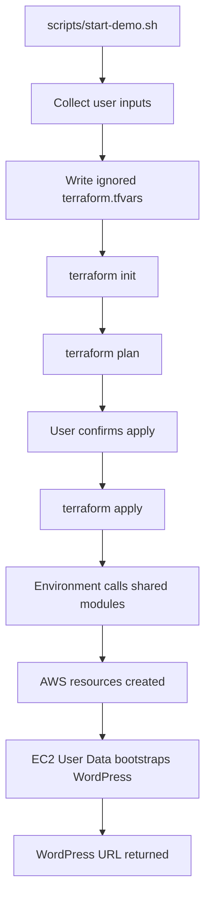
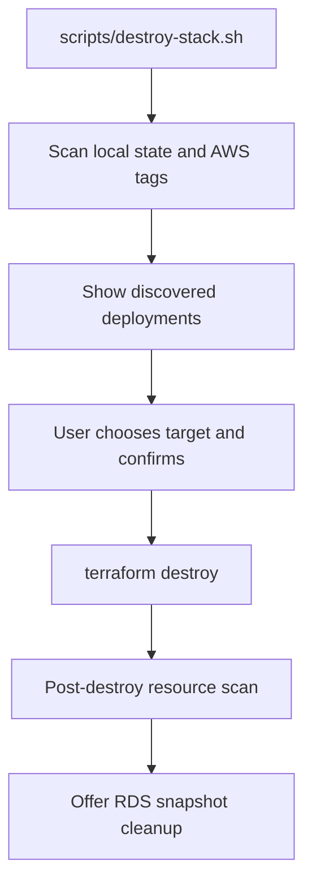

# 🧱 Terraform Architecture

This document explains how the Terraform code is organized, why the project uses separate environments, and how reusable modules keep the infrastructure code clean.

## 🎯 Purpose

The Terraform layout is designed to support multiple WordPress deployment strategies without copying the same AWS resource code over and over.

Instead of writing one large Terraform file for every environment, this project separates the code into:

- **Environment roots**: the deployable folders for `wp-lite`, `wp-rds`, and `wp-mig`.
- **Reusable modules**: shared building blocks for VPC, security groups, EC2, RDS, and S3.

This makes the repository easier to read, easier to expand, and more professional for portfolio review.

## 🗂️ Terraform Folder Layout

```text
terraform/
├── environments/
│   ├── wp-lite/
│   ├── wp-rds/
│   └── wp-mig/
└── modules/
    ├── vpc/
    ├── security/
    ├── ec2/
    ├── rds/
    └── s3/
```

The `environments` folders are where Terraform is actually run. The `modules` folders contain reusable resource definitions that are called by those environments.

## 🧭 Environment Roots

Each environment root represents one deployable version of the project.

### 🪶 `wp-lite`

`wp-lite` is the lowest-cost demo path. It creates a custom VPC, security groups, and one public EC2 instance. WordPress, Apache, PHP, and MariaDB are installed on the same EC2 instance.

This environment is useful for:

- fast demonstrations,
- low-cost testing,
- short-lived portfolio screenshots,
- proving the EC2 bootstrap flow.

It does not create RDS, S3, a NAT Gateway, a Load Balancer, CloudFront, or HTTPS automation.

### 🗄️ `wp-rds`

`wp-rds` is the more realistic hosting path. It keeps WordPress on EC2, but moves the database into Amazon RDS MySQL in private subnets. It also creates an S3 bucket for backup and demo upload workflows.

This environment is useful for:

- showing separation between web and database tiers,
- practicing private RDS networking,
- demonstrating EC2-to-RDS connectivity,
- demonstrating EC2-to-S3 IAM access,
- preparing for future production hardening.

### 🚚 `wp-mig`

`wp-mig` is the migration-focused path. It uses a similar infrastructure shape to `wp-rds`, but the goal is different: it acts as a clean AWS landing zone for a future migrated WordPress site.

This environment is useful for:

- migration practice,
- client rehosting scenarios,
- validating source WordPress readiness,
- staging migration artifacts,
- planning restore, validation, rollback, and DNS cutover steps.

The project intentionally keeps `wp-mig` separate from `wp-rds` so migration-specific scripts, documentation, and future restore workflows do not clutter the general RDS hosting demo.

## 🧩 Module Breakdown

The shared modules live under `terraform/modules`. Each module owns one infrastructure concern.

### 🌐 `modules/vpc`

The VPC module creates the network foundation used by each environment.

It is responsible for:

- the custom VPC,
- public subnets,
- private subnets,
- internet gateway,
- route table resources,
- subnet outputs consumed by other modules.

The environment decides the VPC CIDR range, while the module handles the repeatable resource pattern.

### 🔐 `modules/security`

The security module creates the security groups used by WordPress and the database.

It is responsible for:

- allowing HTTP access to the WordPress EC2 instance,
- allowing SSH access from the configured CIDR,
- allowing database traffic from the WordPress security group to the database security group,
- outputting security group IDs for EC2 and RDS.

This keeps network access rules centralized instead of spreading them across every environment file.

### 🖥️ `modules/ec2`

The EC2 module creates the WordPress server.

It is responsible for:

- the EC2 instance,
- AMI lookup,
- instance type selection,
- key pair attachment,
- User Data rendering,
- optional IAM role and instance profile for S3 access,
- root volume tagging,
- public IP and public DNS outputs.

The EC2 module is reused by all three environments. The key difference is the `install_mode` value:

- `local-db` tells the server to install MariaDB locally for `wp-lite`.
- `rds` tells the server to connect WordPress to an RDS database for `wp-rds` and `wp-mig`.

### 🗄️ `modules/rds`

The RDS module creates the managed MySQL database used by `wp-rds` and `wp-mig`.

It is responsible for:

- the RDS subnet group,
- the MySQL database instance,
- private subnet placement,
- database security group attachment,
- encrypted storage,
- backup retention settings,
- final snapshot behavior for disposable demos.

`wp-lite` does not call this module because it uses local MariaDB on the EC2 instance.

### 🪣 `modules/s3`

The S3 module creates the bucket used by `wp-rds` and `wp-mig`.

It is responsible for:

- the S3 bucket,
- public access blocking,
- versioning settings,
- bucket outputs for EC2 IAM access and future backup workflows.

In `wp-rds`, the bucket supports backup/demo upload behavior. In `wp-mig`, the bucket is intended for migration artifacts and rollback material.

## 🔁 How Reuse Works

The environments reuse modules by passing different inputs into the same module interfaces.

For example, each environment can call the EC2 module, but pass different values:

```hcl
module "ec2" {
  source = "../../modules/ec2"

  instance_type = var.instance_type
  key_name      = var.key_name
  install_mode  = "local-db" # or "rds"
}
```

This means the project can change behavior without duplicating the whole EC2 resource definition.

## 🏷️ Tagging Logic

Each environment builds a shared `common_tags` map and passes it into the modules.

The standard tag model is:

```text
Project      = wordpress-flagship
Architecture = wp-lite / wp-rds / wp-mig
Deployment   = unique deployment name
ManagedBy    = terraform
Purpose      = wordpress-demo
```

This makes it easier to:

- identify resources created by this project,
- filter resources by architecture,
- discover live deployments,
- verify cleanup after destroy,
- support future cost reporting.

## 🚀 Deployment Flow

At a high level, the deployment flow looks like this:



The startup script does not replace Terraform. It simply makes the Terraform workflow easier for a beginner by collecting values, writing local variables, and running the expected Terraform commands.

## 🧹 Destroy Flow

The destroy script is designed around cost control.

At a high level:



Terraform destroy is preferred because Terraform understands dependencies between resources. The AWS tag scan helps identify resources that may still exist or may need manual investigation.

## ⚖️ Why This Layout Matters

This layout demonstrates professional Infrastructure as Code habits:

- environments are separated by purpose,
- modules are separated by responsibility,
- shared logic is reused instead of copied,
- sensitive values stay out of Git,
- Terraform state and `.tfvars` files are ignored,
- documentation explains both the code and the business reason behind it,
- cleanup is treated as part of the deployment lifecycle.

For portfolio review, this shows that the project is not only able to create AWS resources. It also shows planning around maintainability, repeatability, cost control, migration readiness, and future production hardening.
