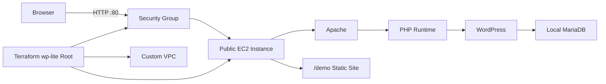

# 🪶 wp-lite Guide

`wp-lite` is the low-cost demo environment.

It creates one EC2 instance and installs both WordPress and MariaDB on that same instance. It does not create RDS, NAT Gateway, Load Balancer, or CloudFront.

## Architecture Summary

`wp-lite` is designed as the smallest useful WordPress-on-AWS proof of concept. It keeps the web server, PHP runtime, WordPress files, and MariaDB database on one EC2 instance so the deployment stays inexpensive, easy to understand, and easy to destroy after a demonstration.



This environment is intentionally not production-grade. Its value is that it proves the full deployment lifecycle: Terraform creates AWS infrastructure, EC2 User Data bootstraps the server, WordPress becomes available in the browser, and the destroy script can remove the stack afterward.

## Best Use Cases

- Portfolio demos.
- Short-lived screenshots.
- Practicing Terraform workflows.
- Testing WordPress bootstrap scripts.

## Technical Implementation Notes

The `wp-lite` Terraform root is located at `terraform/environments/wp-lite`. It calls shared modules for networking, security, and compute instead of defining every AWS resource directly in one file.

Core technical behaviors:

- `module.vpc` creates the custom VPC, subnets, internet gateway, and route table resources.
- `module.security` creates the WordPress security group for HTTP and SSH access.
- `module.ec2` creates the WordPress EC2 instance and passes bootstrap values into `user-data.sh.tftpl`.
- `install_mode = "local-db"` tells the EC2 bootstrap process to install MariaDB on the same instance.
- `db_host = "localhost"` keeps WordPress database traffic inside the EC2 instance instead of reaching out to RDS.
- `site_archive_path` allows the launcher to package the static demo website and deploy it under `/demo/`.
- `wp_admin_user`, `wp_admin_email`, and `wp_admin_password` are used by WP-CLI during first boot to create the WordPress admin login.

During first boot, EC2 User Data performs the server configuration work that would otherwise be done manually over SSH:

- Installs Apache, PHP extensions, MariaDB, WP-CLI, and helper packages.
- Creates the local MariaDB database and WordPress database user.
- Downloads WordPress from `wordpress.org`.
- Writes `wp-config.php` with the generated local database settings.
- Runs `wp core install` through WP-CLI.
- Seeds basic pages and a primary navigation menu.
- Copies the static infrastructure demo into `/var/www/html/demo`.
- Restarts Apache after file permissions are set.

## What This Demonstrates

From a portfolio perspective, `wp-lite` demonstrates more than launching a virtual machine. It shows that the repository can automate a complete application stack with repeatable infrastructure and application bootstrap logic.

Skills demonstrated:

- Terraform root module organization.
- AWS VPC and subnet design for a simple public web server.
- Security group configuration for HTTP and SSH.
- EC2 User Data automation.
- Linux package installation and service management.
- Apache/PHP/WordPress runtime setup.
- MariaDB database provisioning.
- WP-CLI based WordPress installation and content seeding.
- Git-safe handling of local `.tfvars` values.
- Cost-conscious teardown through the destroy helper.

## Important Tradeoffs

`wp-lite` is intentionally simple, so it accepts tradeoffs that would not be ideal for a production client site:

- The database is on the same EC2 instance, so losing the instance can also lose the database unless backups are taken.
- There is no load balancer, so traffic goes directly to the EC2 public endpoint.
- There is no ACM certificate or HTTPS automation yet.
- SSH may be opened broadly during testing unless the user provides a narrower CIDR range.
- Scaling is vertical only; increasing capacity means changing the EC2 instance size.
- Backups, monitoring, and managed database recovery are better handled by the later `wp-rds` path.

These tradeoffs are acceptable for a disposable demo environment, but the project intentionally separates `wp-rds` and `wp-mig` so more realistic hosting and migration patterns can be demonstrated later.

## You can add your own domain in the backend so that it has a proper site domain

!!! todo: demonstrate how to add ACM to create a https domain from person's choosing

## Deploy a wp-lite env


🟢NOTE: The CLI has default parameters set in `[default-value]` which automatically apply by just pressing `Enter`.

## 1. Starting the script
From the project root, type the following:
```bash
chmod 700 scripts/start-demo.sh # that's if you never gave permissions
./scripts/start-demo.sh
```
The script checks your shell env to ensure that the necessary packages are installed for the script to use. It shows this by displaying green `[ok]` for every required package used.

## 2. Entering inputs for the script
For ease, a lot of the script is geared towards building a `wp-lite` deployment, so the default values have been preloaded as a suggestion by just pressing `Enter`.

Below is a simplified line-by-line input request to configure the script into building a `wp-lite` project as needed, with comments to explain the goal of what is trying to be improved:

```bash
Environment: wp-lite, wp-rds, or wp-mig [wp-lite]: # which deployment you want (wp-lite, wp-rds, wp-mig)

Website display name [Cloud WordPress Demo]: # the name of the website, can be anything

Use a custom static demo folder instead of website/default-site? yes or no [no]: # this is in case you wanted to push your own website source code, 'no' is default

AWS CLI profile name [default]: # the aws account moniker associated to your account that is saved in your aws-cli local install, usually the only one account is called 'default'

AWS region [us-east-1]: # which region you want to build all the supporting resources for this project, i.e. EC2, Database etc

Existing EC2 key pair name [replace-with-your-key-pair]: # type in an existing EC2 key-pair from your account

SSH allowed CIDR [0.0.0.0/0]: # if you know what IP schematic (public or private) you want to allow to your box, type it in. if not leave as is and then configure security settings later once up and running

EC2 instance type [t3.micro]: # default, simple EC2. Depending on goals, this may change to improve quality
```
## 3. Confirming AWS Resources from Terraform
Once set, the script will start Terraform, scaffolding resouces to then push onto AWS to build. Before doing so, the script will ask if these resources are okay. Type `yes` to conintue:


## 4. Cloud Built, Checking Endpoints
Then the script will run a while, building AWS resources through the local aws sso account set up before. There will be a heartbeat check on whether the EC2 instance is ready to be visited online:


## 5. Display login info
And then all the login information, to both the MariaDB and the Wordpress Admin page, with proper endpoint URLs are displayed for you to click through:


With the links and login information provided, you can get to the homepage, and also the Wordpress dashboard to start editing your website:

Homepage


Login Page


Wordpress Dashboard


When prompted for the database password, remember that this is the hidden MariaDB login WordPress uses internally. When prompted for the WordPress admin password, use a separate password for the `/wp-admin/` browser login.

After the site is live, the WordPress admin password can be changed from the WordPress dashboard.

After the instance finishes bootstrapping:

- Visit `/` for the WordPress site.
- Visit `/wp-admin/` for WordPress admin.
- Visit `/demo/` for the static Terraform/AWS demo pages.

Manual deployment:

```bash
cd terraform/environments/wp-lite
terraform init
terraform plan
terraform apply
```

Use placeholder values in committed files. Provide real database and WordPress admin passwords only through local variables, environment variables, or an ignored `.tfvars` file.

## Seed Demo Content

After WordPress is installed, copy the seed script to the instance and run it:

```bash
scp scripts/seed-wordpress.sh ubuntu@your-instance-public-dns:/tmp/seed-wordpress.sh
ssh ubuntu@your-instance-public-dns "chmod +x /tmp/seed-wordpress.sh && sudo SITE_URL='http://your-instance-public-dns' /tmp/seed-wordpress.sh"
```

## Destroy

Destroy this environment when the demo is finished.

```bash
./scripts/destroy-stack.sh
```
