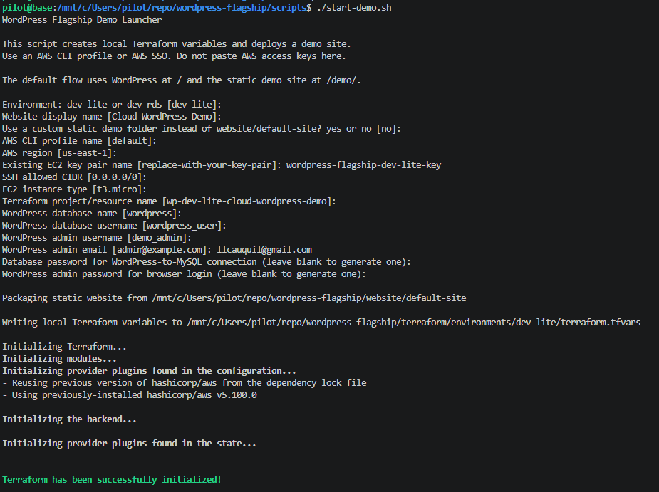
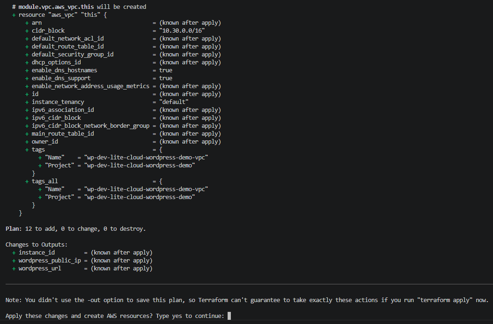
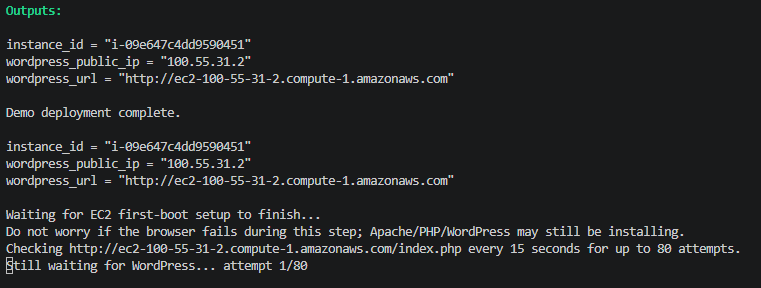
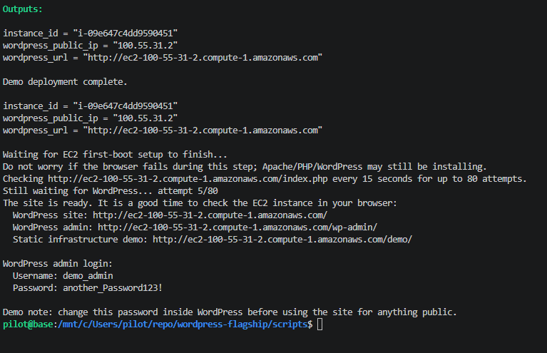
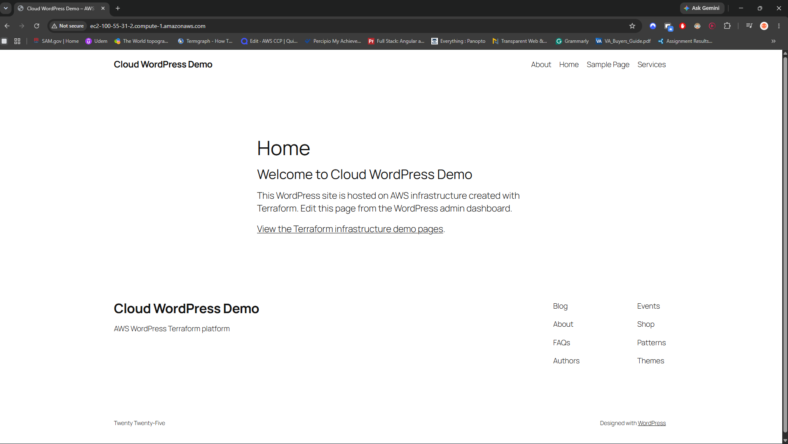
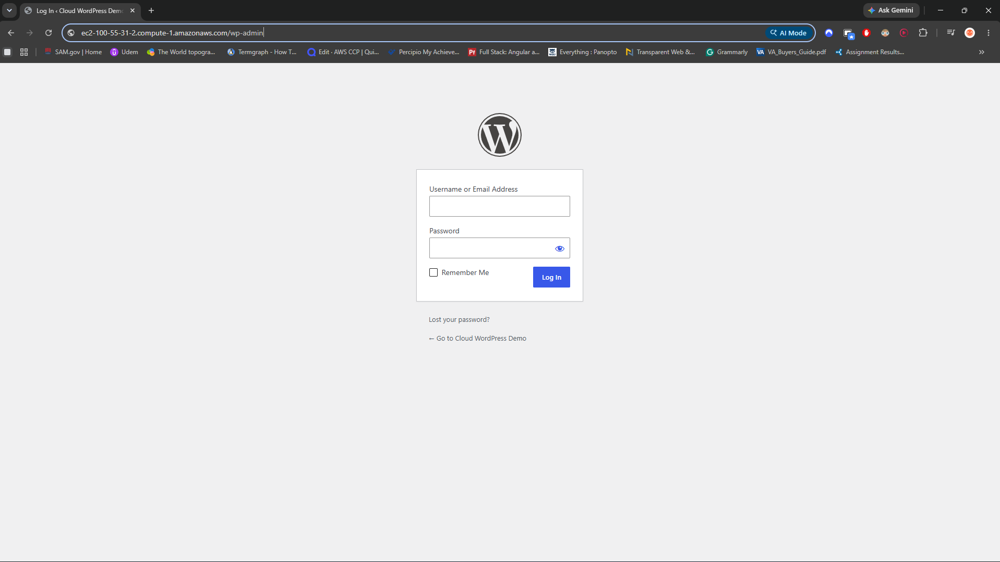
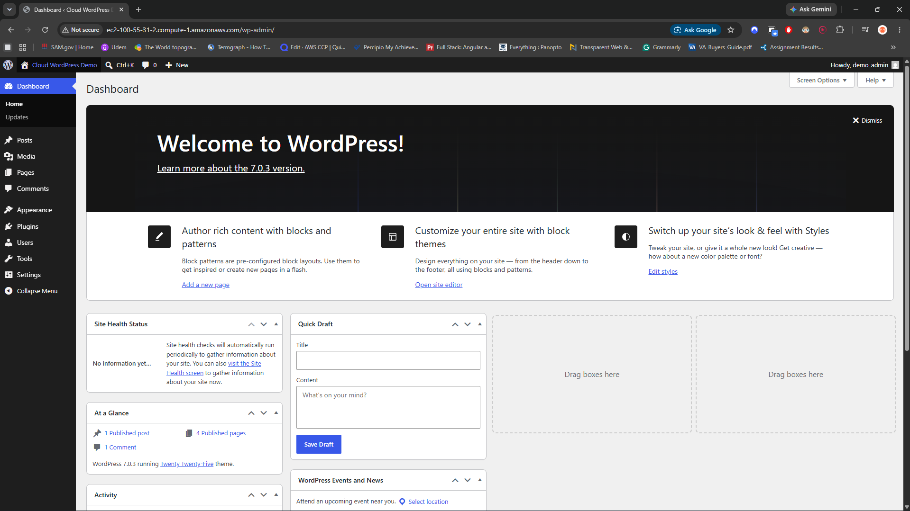

# wp-lite Guide

`wp-lite` is the low-cost demo environment.

It creates one EC2 instance and installs both WordPress and MariaDB on that same instance. It does not create RDS, NAT Gateway, Load Balancer, or CloudFront.

## Best Use Cases

- Portfolio demos.
- Short-lived screenshots.
- Practicing Terraform workflows.
- Testing WordPress bootstrap scripts.

## You can add your own domain in the backend so that it has a proper site domain

## Deploy

Guided deployment:

```bash
./scripts/start-demo.sh
```

Choose `wp-lite` when the launcher asks for the environment. Before Terraform runs, the script checks that required local tools are installed, the AWS profile is authenticated, the EC2 key pair exists in the selected region, and the static demo site folder is usable.

This will start the first set of queries for the script to begin asking some variable initiliazing for the script to use:


Once set, the script will start Terraform, scaffolding resouces to then push onto AWS to build. Before doing so, the script will ask if these resources are okay. Type `yes` to conintue:


Then the script will run a while, building AWS resources through the local aws sso account set up before. There will be a heartbeat check on whether the EC2 instance is ready to be visited online:


And then all the login information, to both the MariaDB and the Wordpress Admin page, with proper endpoint URLs are displayed for you to click through:


With the links and login information provided, you can get to the homepage, and also the Wordpress dashboard to start editing your website:

Homepage


Login Page


Wordpress Dashboard


When prompted for the database password, remember that this is the hidden MariaDB login WordPress uses internally. When prompted for the WordPress admin password, use a separate password for the `/wp-admin/` browser login.

After the site is live, the WordPress admin password can be changed from the WordPress dashboard.

After the instance finishes bootstrapping:

- Visit `/` for the WordPress site.
- Visit `/wp-admin/` for WordPress admin.
- Visit `/demo/` for the static Terraform/AWS demo pages.

Manual deployment:

```bash
cd terraform/environments/wp-lite
terraform init
terraform plan
terraform apply
```

Use placeholder values in committed files. Provide real database and WordPress admin passwords only through local variables, environment variables, or an ignored `.tfvars` file.

## Seed Demo Content

After WordPress is installed, copy the seed script to the instance and run it:

```bash
scp scripts/seed-wordpress.sh ubuntu@your-instance-public-dns:/tmp/seed-wordpress.sh
ssh ubuntu@your-instance-public-dns "chmod +x /tmp/seed-wordpress.sh && sudo SITE_URL='http://your-instance-public-dns' /tmp/seed-wordpress.sh"
```

## Destroy

Destroy this environment when the demo is finished.

```bash
terraform destroy
```
