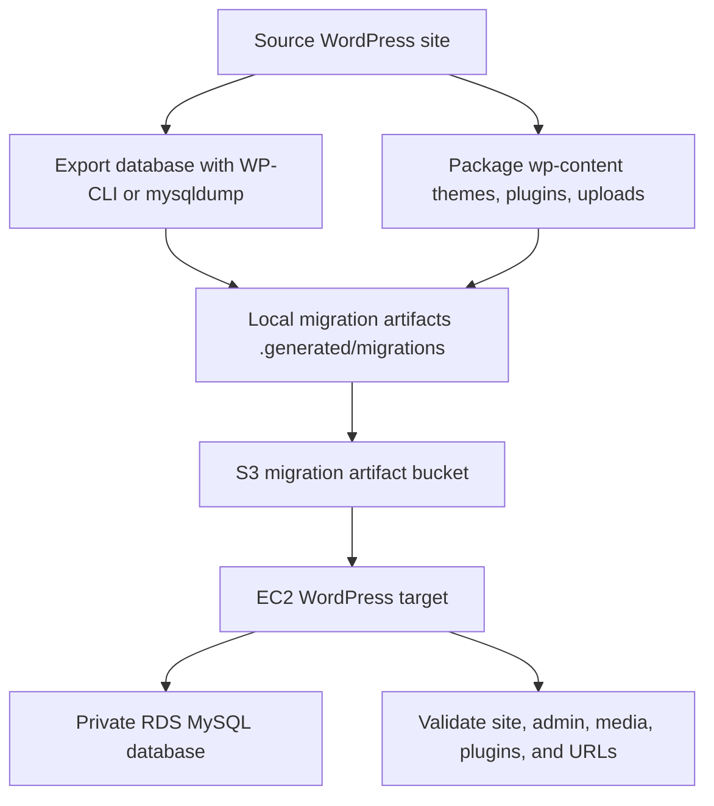

# wp-mig Guide

`wp-mig` is the migration-focused environment for demonstrating how an existing WordPress site can be moved into AWS infrastructure managed by Terraform.

The first practical goal is a portfolio-safe migration workflow:

```text
Provision -> Export -> Transfer -> Restore -> Reconfigure -> Validate -> Rollback/Cleanup
```

## Purpose

- Build a clean AWS target for WordPress migrations.
- Demonstrate EC2, RDS, S3, Terraform, Bash, WP-CLI, and migration validation.
- Keep client content, database dumps, private keys, and secrets out of Git.
- Show that migration is more than copying files: database URLs, serialized data, ownership, permissions, rollback, and validation all matter.

## Architecture



`wp-mig` reuses the same module pattern as `wp-rds`:

- Custom VPC with public and private subnets.
- EC2 WordPress server in a public subnet.
- RDS MySQL in private subnets.
- S3 bucket for migration artifacts, backups, and rollback material.
- IAM access for the EC2 instance to work with the S3 artifact bucket.

There is no NAT Gateway, Load Balancer, CloudFront, ACM certificate, or automated DNS cutover yet. Those are future production-hardening steps.

## What Gets Migrated

The migration workflow should preserve:

- WordPress database content.
- `wp-content/uploads`.
- Active theme files.
- Required plugin files.
- Migration metadata, checksums, and logs.

The workflow should not blindly copy:

- Old `wp-config.php` database credentials.
- Old database hostnames.
- Old cache paths or host-specific plugin settings.
- Private keys, AWS credentials, or production secrets.
- Client database dumps into Git.

## Step 1: Provision The Target

Run the normal launcher:

```bash
./scripts/start-demo.sh
```

Choose:

```text
wp-mig
```

This provisions the AWS migration target: EC2, private RDS MySQL, S3, VPC networking, security groups, and the WordPress bootstrap.

## Step 2: Run Migration Preflight

Before moving data, run the read-only migration worker:

```bash
./scripts/check-migration-readiness.sh --target-env wp-mig --profile your-profile-name --region us-east-1
```

If you have a local source WordPress folder, add:

```bash
./scripts/check-migration-readiness.sh \
  --target-env wp-mig \
  --profile your-profile-name \
  --region us-east-1 \
  --source-path /path/to/source/wordpress \
  --source-url https://source.example.com
```

The preflight checks:

- Local tools such as Terraform, AWS CLI, SSH, SCP, tar, gzip, MySQL client, dump utility, and optional WP-CLI.
- AWS authentication through a profile or SSO.
- Terraform target outputs when the target has already been provisioned.
- Source WordPress filesystem markers such as `wp-config.php` and `wp-content`.
- WP-CLI source database authentication when WP-CLI is installed and a source path is provided.

## Step 3: Export Source

Future export automation should create:

- A database dump.
- A compressed `wp-content` archive.
- Migration metadata.
- Checksums.
- A migration log.

Recommended artifact location:

```text
.generated/migrations/<project-slug>/
```

These files are ignored by Git because they may contain client data.

## Step 4: Restore Into Target

The restore phase should:

- Back up the target database before replacing it.
- Preserve the target `wp-content` before replacing files.
- Import the source database into RDS through the EC2 host or another secure path.
- Copy `wp-content` to the target.
- Keep the target `wp-config.php` database credentials created by Terraform.
- Run `wp search-replace` for source-to-target URL changes so serialized WordPress data is handled safely.
- Fix ownership and permissions.
- Restart Apache if needed.

## Step 5: Validate

Validation should confirm:

- EC2 is reachable.
- Apache/PHP is running.
- WordPress files exist.
- `wp-config.php` exists and points at the target database.
- RDS tables exist.
- Home URL and site URL are correct.
- Homepage and `/wp-admin/` respond.
- Uploads directory exists.
- Plugins and theme files are present.

## Rollback

Before importing over an existing target, preserve:

- Current target database export.
- Current target `wp-content`.
- Migration timestamp and metadata.

For demos, rollback can be simple: restore the preserved target database and `wp-content`, then rerun validation.

## Cleanup

Destroy the migration target when finished:

```bash
./scripts/destroy-stack.sh --env wp-mig --profile your-profile-name
```

To inspect possible resources without deleting:

```bash
./scripts/destroy-stack.sh --env wp-mig --scan-only --profile your-profile-name
```

## Current Status

Implemented:

- Deployable `wp-mig` Terraform target based on the `wp-rds` architecture.
- `start-demo.sh` branch for provisioning `wp-mig`.
- Destroy support for `wp-mig`.
- Read-only migration readiness worker.
- Git ignore protection for migration artifacts and database dumps.

Next:

- Export source database and `wp-content`.
- Upload artifacts to S3.
- Restore database/files into the target.
- Run URL replacement with WP-CLI.
- Produce a migration validation report.
