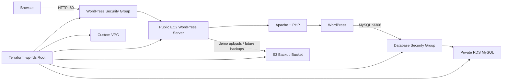

# wp-rds Guide

`wp-rds` is the more realistic development environment.

It creates one EC2 instance for WordPress, one RDS MySQL database in private subnets, and one S3 bucket reserved for backups. It does not include NAT Gateway, Load Balancer, or CloudFront yet.

## Architecture Summary

`wp-rds` is the next step after `wp-lite`. It keeps the WordPress web tier on EC2, but moves the database tier into Amazon RDS MySQL inside private subnets. This creates a more realistic hosting model because the web server and database are separated, database access is controlled by security groups, and S3 is available for backup-oriented workflows.



The EC2 instance is still public for demo simplicity, but the RDS database is not publicly exposed. WordPress reaches RDS through the internal VPC network using the database endpoint Terraform passes into the EC2 bootstrap process.

## Best Use Cases

- Demonstrating separation between application and database tiers.
- Practicing private RDS networking.
- Testing backup workflows with S3.
- Preparing for later production hardening.

## Technical Implementation Notes

The `wp-rds` Terraform root is located at `terraform/environments/wp-rds`. It reuses the same module pattern as `wp-lite`, then adds managed database and storage resources.

Core technical behaviors:

- `module.vpc` creates the custom VPC, public subnets, private subnets, route table resources, and internet gateway.
- `module.security` creates separate security group rules for the WordPress web tier and the RDS database tier.
- `module.rds` provisions Amazon RDS MySQL in private subnets using a database subnet group.
- `module.backup_bucket` creates an S3 bucket for future backups and demo upload workflows.
- `module.ec2` provisions the WordPress EC2 instance in a public subnet.
- `install_mode = "rds"` tells the EC2 bootstrap process to use a remote MySQL endpoint instead of installing MariaDB locally.
- `db_host = module.rds.db_endpoint` passes the private RDS endpoint into WordPress configuration.
- `enable_s3_access = true` attaches IAM permissions so the EC2 instance can upload demo files to the S3 bucket.

During first boot, EC2 User Data installs Apache, PHP extensions, WP-CLI, WordPress, and the AWS CLI. It writes `wp-config.php` with the RDS connection values, runs the first WordPress install through WP-CLI, seeds basic pages/navigation, and creates the admin-only RDS + S3 lab page.

## What This Demonstrates

From a portfolio perspective, `wp-rds` shows that the project can move beyond a single-server demo into a more realistic cloud architecture.

Skills demonstrated:

- Terraform composition across multiple reusable modules.
- Public web tier plus private database tier design.
- RDS subnet group usage.
- Security group based database access control.
- EC2-to-RDS WordPress configuration.
- S3 bucket provisioning for backup and artifact workflows.
- IAM role and instance profile usage for EC2-to-S3 access.
- User Data based application bootstrap.
- RDS + S3 demo functionality visible inside WordPress.
- Cost-aware cleanup using Terraform destroy and S3 `force_destroy` for disposable demos.

## Important Tradeoffs

`wp-rds` is more realistic than `wp-lite`, but it is still intentionally demo-focused:

- There is no load balancer yet, so users connect directly to one EC2 instance.
- There is no ACM certificate or HTTPS automation yet.
- There is no CloudFront CDN.
- There is no NAT Gateway, which keeps cost down but also means private subnet resources should not require direct outbound internet access.
- The EC2 instance is not in an Auto Scaling Group.
- RDS final snapshots are skipped for disposable demos to reduce leftover snapshot storage costs.
- S3 `force_destroy` is enabled so demo uploads do not block cleanup.

These choices keep the environment approachable for portfolio demos while preserving a clear path toward production hardening.

## Deploy

Guided deployment:

```bash
./scripts/start-demo.sh
```

Choose `wp-rds` when the launcher asks for the environment.

The database password is the hidden RDS MySQL login WordPress uses internally. The WordPress admin password should remain a separate password for the `/wp-admin/` browser login.

The launcher also asks for a globally unique S3 backup bucket name. The default includes your project name, AWS region, and AWS account ID to reduce naming conflicts.

After the instance finishes bootstrapping:

- Visit `/` for the WordPress site.
- Visit `/wp-admin/` for WordPress admin.
- Visit `/demo/` for the static Terraform/AWS demo pages.
- Visit `/demo/rds-lab.php` for the admin-only RDS + S3 lab.

## RDS + S3 Lab

The `wp-rds` bootstrap creates an admin-only demo page at `/demo/rds-lab.php`.

This page lets a WordPress administrator:

- Add simple demo rows to the RDS-backed WordPress database.
- Edit row text and status values.
- Upload a file to the S3 backup bucket and link the S3 URI to a database row.

This is meant to make the RDS and S3 backend visible during portfolio demos. It is not a production file manager.

Manual deployment:

```bash
cd terraform/environments/wp-rds
terraform init
terraform plan
terraform apply
```

The `backup_bucket_name` value must be globally unique. Keep real database and WordPress admin passwords out of Git.

## Seed Demo Content

After WordPress is installed, copy the seed script to the EC2 instance and run it:

```bash
scp scripts/seed-wordpress.sh ubuntu@your-instance-public-dns:/tmp/seed-wordpress.sh
ssh ubuntu@your-instance-public-dns "chmod +x /tmp/seed-wordpress.sh && sudo SITE_URL='http://your-instance-public-dns' /tmp/seed-wordpress.sh"
```

## Destroy

```bash
./scripts/destroy-stack.sh --env wp-rds --profile your-profile-name
```

The `wp-rds` environment costs more than `wp-lite` because RDS runs as a separate managed database. The destroy helper removes the Terraform-managed EC2 instance, RDS database, S3 backup bucket, IAM role/profile, VPC resources, and security groups.

The S3 bucket is configured for demo cleanup with `force_destroy`, which allows Terraform to delete uploaded lab files during `terraform destroy`. Do not use this setting for production buckets that must preserve client backups.

To inspect possible project resources without deleting anything:

```bash
./scripts/destroy-stack.sh --env wp-rds --scan-only --profile your-profile-name
```

## Diagnose

For a safe read-only check of the EC2 instance, RDS database, S3 bucket, and HTTP endpoint:

```bash
AWS_PROFILE=your-profile-name ./scripts/diagnose-wp-rds.sh
```
